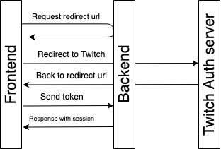

# Auth with twitch mechanism

Authorization with twitch has 5 steps:

1. The front receives a new redirect URL - [Receive redirect URL for auth](#receive-redirect-url-for-auth)
1. The front redirects a user to received URL
1. Twitch returns the user to the front with auth token after Auth
1. The front sends the token to the backend - [Auth by code](#auth-by-code)
1. Backend receives user info by token and returns a response with session authentication



## API Methods

### Receive redirect URL for auth


Request: `GET /api/v1/auth/redirect-url`

**Response:**

```json

```

### Auth by code


**Request:** `POST /api/v1/auth/post`

**Request data:**

```json
{
  "code": "334442ikjds--s0dff"
}
```

**Response:**

```json

```

### Logout

**Request:** `POST /api/v1/auth/logout`

**Request data:**

```json
{}
```

